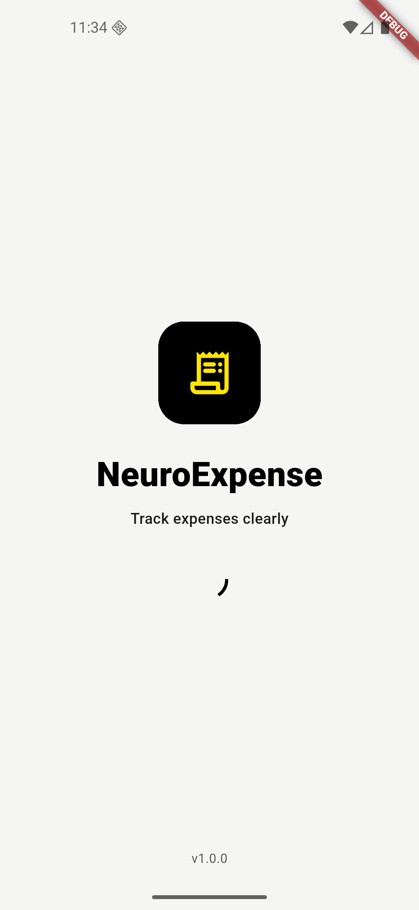
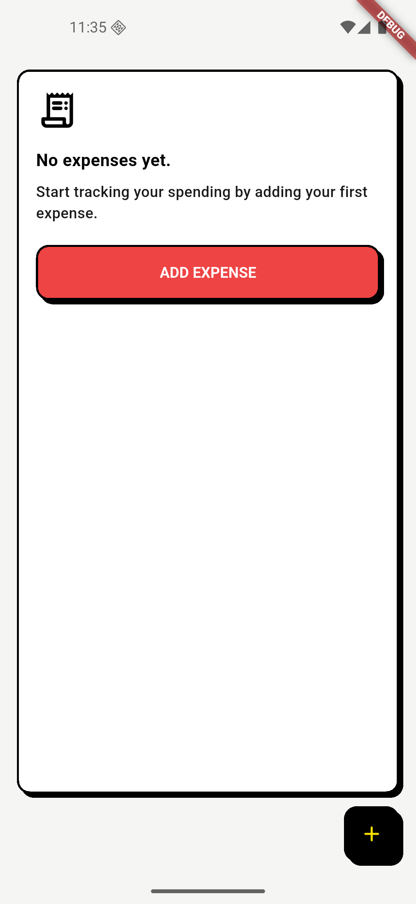
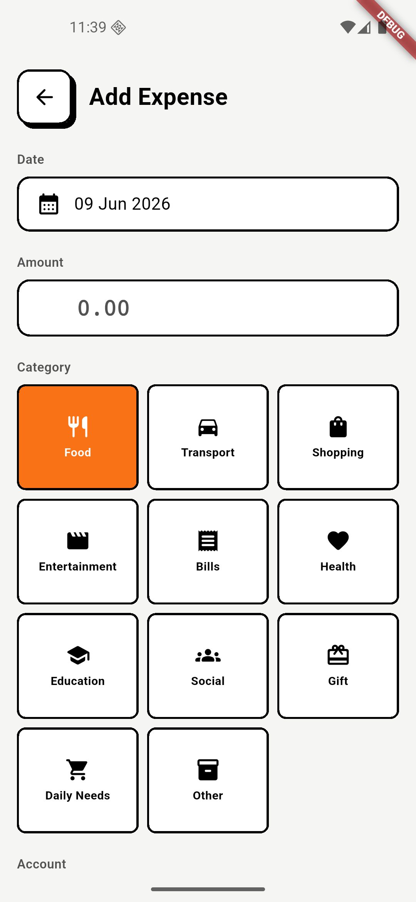
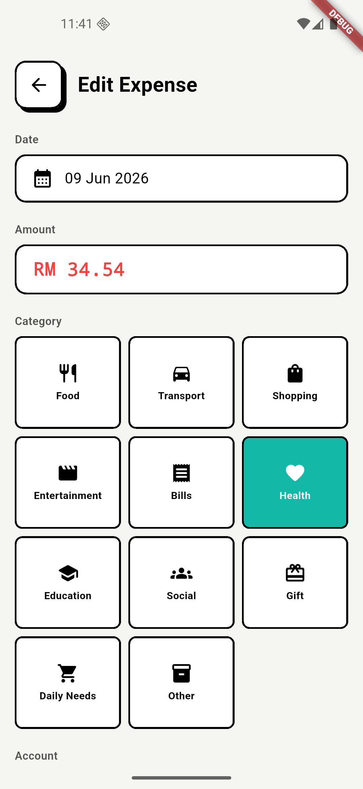
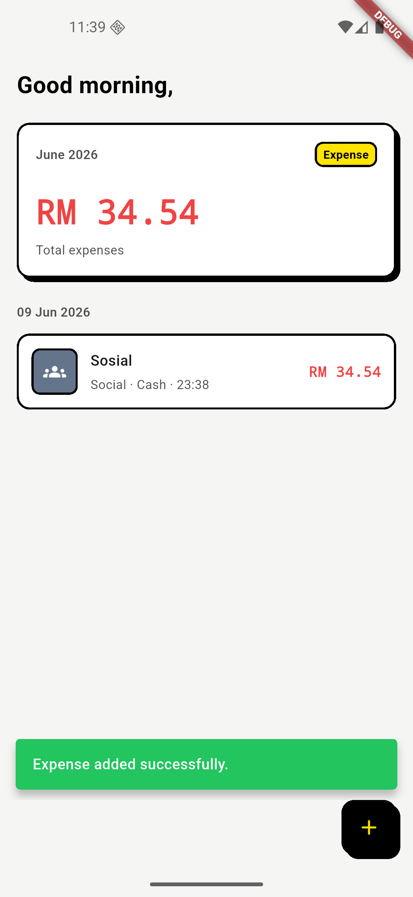
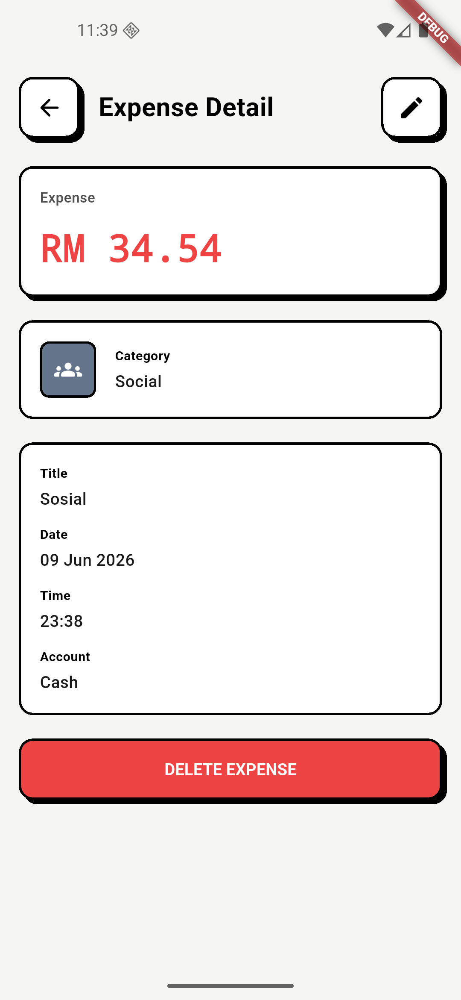

# NeuroExpense Tracker

NeuroExpense Tracker is a simple personal expense tracker built with Flutter for the Neurogine mobile developer technical assessment.

The app focuses on expense tracking only. It allows users to view expenses, add new expenses, edit existing expenses, delete expenses, and see total spending in Ringgit Malaysia.

## Features

- Expense dashboard with total expense summary
- Add expense form
- Expense detail screen
- Edit expense flow
- Delete expense flow
- Expense category selection
- Account source selection
- Local persistence with Hive CE
- Ringgit Malaysia currency formatting
- Empty, loading, error, and success states
- Neobrutalism UI style

## Tech Stack

| Area | Technology |
| --- | --- |
| Framework | Flutter, Dart |
| Architecture | Lightweight Clean Architecture, Feature-driven structure |
| State Management | flutter_riverpod, riverpod_generator |
| Navigation | go_router |
| Local Persistence | Hive CE, hive_ce_flutter |
| Model | Freezed, JSON Serializable |
| Code Generation | build_runner |
| Utility | intl, uuid |
| Testing | flutter_test |

## Architecture

This project uses a lightweight feature-driven architecture inspired by Clean Architecture.

The implementation separates presentation, domain models, repository, and local persistence while avoiding unnecessary use case abstractions for the small assessment scope.

Data flow:

```text
Page
  → Riverpod Controller
    → Repository
      → Local Data Source
        → Hive CE
```

Save flow:

```text
Form Input
  → Expense Entity
    → ExpenseModel
      → Hive JSON Map
```

Key engineering decisions:

- Riverpod Generator is used for state management and dependency wiring.
- Hive CE is used for local-first persistence.
- Freezed is used for immutable data models and UI states.
- go_router is used for route-based navigation.
- Currency formatting is centralized for Ringgit Malaysia.
- UI widgets are split into reusable Neobrutalism components.
- Expensive operations are kept outside widget build methods.

## Folder Structure

```text
lib/
  main.dart

  app/
    app.dart
    router/
      app_router.dart
      route_paths.dart
    theme/
      app_theme.dart
      neo_colors.dart
      neo_dimens.dart
      neo_spacing.dart
      neo_text_styles.dart

  core/
    constants/
      hive_box_names.dart
    errors/
      app_exception.dart
    utils/
      currency_formatter.dart
      date_formatter.dart
    widgets/
      neo_button.dart
      neo_card.dart
      neo_confirm_dialog.dart
      neo_currency_input.dart
      neo_date_picker_field.dart
      neo_empty_state.dart
      neo_error_state.dart
      neo_input.dart
      neo_loading_state.dart
      neo_snackbar.dart

  features/
    expenses/
      data/
        expense_local_datasource.dart
        expense_local_datasource_impl.dart
        expense_model.dart
        expense_repository.dart
        expense_repository_impl.dart
      domain/
        account_source.dart
        expense.dart
        expense_category.dart
      presentation/
        pages/
          add_expense_page.dart
          edit_expense_page.dart
          expense_detail_page.dart
          expense_list_page.dart
        providers/
          account_source_mapper.dart
          expense_category_mapper.dart
          expense_data_providers.dart
          expense_detail_provider.dart
          expense_detail_state.dart
          expense_form_input.dart
          expense_form_provider.dart
          expense_form_state.dart
          expense_list_provider.dart
          expense_list_state.dart
        widgets/
          account_source_picker.dart
          expense_card.dart
          expense_category_picker.dart
          expense_form.dart
          expense_summary_card.dart

    splash/
      presentation/
        pages/
          splash_page.dart
```

## Routes

| Route | Screen |
| --- | --- |
| `/splash` | Splash screen |
| `/expenses` | Expense dashboard |
| `/expenses/add` | Add expense |
| `/expenses/:id` | Expense detail |
| `/expenses/:id/edit` | Edit expense |

## Screenshots

| Splash Screen | Empty State |
| --- | --- |
|  |  |

| Add Expense Screen | Edit Expense Screen |
| --- | --- |
|  |  |

| List Expense Screen | Expense Detail Screen |
| --- | --- |
|  |  |

## Currency Format

All expense amounts are displayed in Ringgit Malaysia format.

Examples:

```text
RM 12.50
RM 150.00
RM 1,250.75
```

## How to Run

Install dependencies:

```bash
flutter pub get
```

Generate code:

```bash
dart run build_runner build --delete-conflicting-outputs
```

Run the app:

```bash
flutter run
```

## Testing and Quality Checks

Format code:

```bash
dart format .
```

Analyze code:

```bash
flutter analyze
```

Run tests:

```bash
flutter test
```

## Current Scope

Implemented:

- Expense dashboard
- Add expense
- Expense detail
- Edit expense
- Delete expense
- Local persistence setup with Hive CE
- Riverpod state controllers
- RM currency formatting
- Reusable Neobrutalism widgets
- Basic widget tests

Out of scope:

- Income tracking
- Balance calculation
- Authentication
- Backend API
- Cloud sync
- Multi-device sync
- PDF or CSV export
- Receipt image upload
- OCR scanner
- Push notifications

## Known Limitations

- Expense-only scope
- No dark mode yet
- No search or filter yet
- No daily/monthly toggle yet
- No app icon customization yet
- No advanced financial reporting
- No cloud backup

## Future Improvements

- Add search and category filtering
- Add daily/monthly summary toggle
- Add dark mode
- Add basic chart or spending summary
- Add export to CSV or PDF
- Add cloud sync
- Add custom launcher icon and native splash assets
- Improve automated tests for repository and controller logic

## AI Usage Note

AI tools were used only for guidance, research, planning, and documentation refinement.

The core implementation, architecture, and technical decisions were written, reviewed, and adjusted manually.
